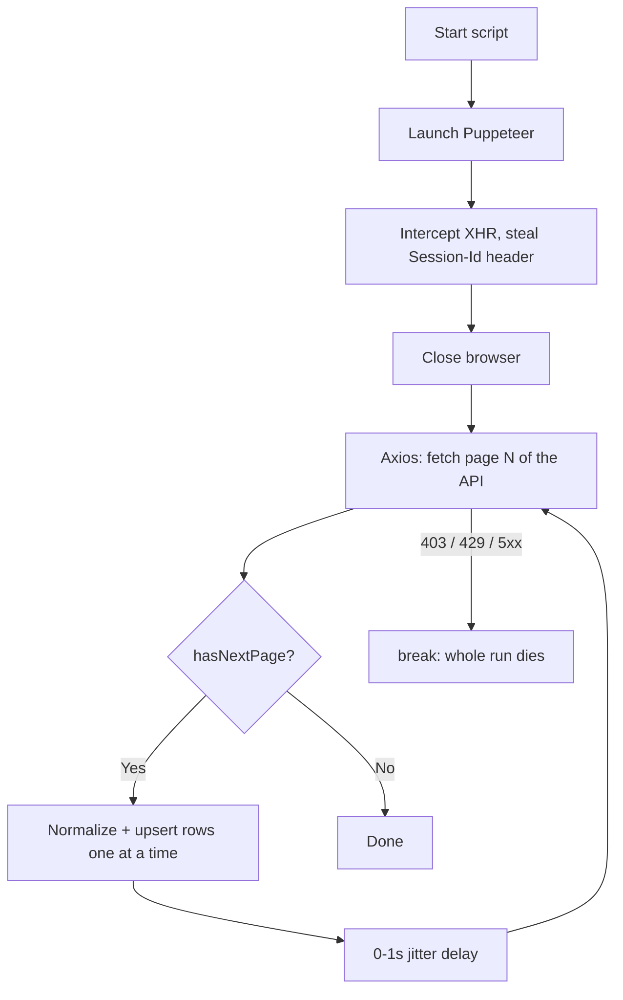

# Architecture

This document explains **where we came from (v1)**, **what we are building
(the target)**, and **how the pieces connect**. It is paired with:

- [`CONCEPTS.md`](CONCEPTS.md) — plain-language explanations of the DSA /
  systems concepts referenced here.
- [`decisions/`](decisions/) — the dated decision log (ADRs). Every "why" in
  this document links to the ADR that records the tradeoff.

---

## 1. Where we came from — the v1 baseline

v1 is a single Node.js process that does everything in one sequential loop
(`scraper/load_cars.js`, `scraper/scraper.js`):



It works, and the "lockpick" header-steal is genuinely clever. But three
properties make it unfit for scale or production:

| Property | Where | Consequence |
|----------|-------|-------------|
| **Sequential** | one `while` loop; page N+1 waits on N; rows inserted one at a time with 4+ serial DB round-trips each (`load_cars.js`) | Throughput is capped at one machine doing one thing at a time. |
| **Fail-fast** | any `403/429/5xx` does `break` (`load_cars.js`, `scraper.js`) | A single transient error kills the entire run. |
| **Manual recovery** | resume only via a hand-passed `startPage` CLI arg | No automatic retry, no checkpoint, a human must babysit it. |

The root cause is **coupling**: the code that *decides what to scrape* (which
page) and the code that *does the scraping* are the same loop, so a failure in
one destroys the other. The rebuild's entire job is to break that coupling. See
[CONCEPTS → Producer/Consumer](CONCEPTS.md#producer--consumer-the-job-queue).

Also carried forward as debts to fix: the Postgres schema DDL currently lives
only in Supabase (no migrations in git), and two divergent scraper scripts
duplicate the header-steal + pagination logic.

---

## 2. Target architecture

A **producer/consumer** system with an external queue between the two roles.

```
                         ┌────────────────────────────────────────┐
                         │  SEEDER / PRODUCER  (1 process)          │
                         │  - steals session headers (Puppeteer)    │
                         │  - discovers how many pages exist         │
                         │  - enqueues one job per page/range        │
                         └───────────────┬──────────────────────────┘
                                         │ enqueue "scrape page N"
                                         ▼
                         ┌────────────────────────────────────────┐
                         │   JOB QUEUE  (external broker)           │
                         │   waiting │ active │ completed │ failed   │
                         │                         └─► DEAD-LETTER    │
                         └───────┬───────────┬───────────┬───────────┘
                    dequeue      │           │           │
              ┌──────────────────┘     ┌─────┘     ┌─────┘
              ▼                        ▼           ▼
        ┌───────────┐          ┌───────────┐  ┌───────────┐
        │ WORKER 1  │          │ WORKER 2  │  │ WORKER N  │   ← scale by
        │ scrape +  │          │ scrape +  │  │ scrape +  │     adding
        │ parse +   │          │ parse +   │  │ parse +   │     containers
        │ upsert    │          │ upsert    │  │ upsert    │
        └─────┬─────┘          └─────┬─────┘  └─────┬─────┘
              └───────────────┬──────┴──────────────┘
                              ▼ idempotent upsert (ON CONFLICT url)
                     ┌──────────────────┐
                     │   POSTGRES        │  normalized 10-table schema
                     │   (+ migrations)  │  + cars_report view
                     └────────┬──────────┘
                              ▼
                     ┌──────────────────┐
                     │   POWER BI        │  (live view or CSV export)
                     └──────────────────┘

     Everything above runs as containers wired together by DOCKER COMPOSE.
```

The decisive change from v1: the single loop is **split in two**. The seeder
*produces* page-jobs and walks away; the worker fleet *consumes* them
independently. A worker crash loses at most one job (which is redelivered), not
the run.

---

## 3. Components & responsibilities

| Component | Responsibility | Notes |
|-----------|----------------|-------|
| **Seeder (producer)** | Bootstrap session headers, discover the page range, enqueue one job per unit of work, then exit. | Does **not** scrape. Runs to completion and stops (or on a schedule). |
| **Job queue (broker)** | Hold jobs durably; hand each to exactly one worker at a time; track `waiting/active/completed/failed`; redeliver on failure; route poison jobs to a dead-letter queue. | External to every worker — this is what enables scaling + fault tolerance. Technology: [ADR-0002, pending]. |
| **Worker (consumer) × N** | Pull a job, fetch that page via the stolen headers, parse/normalize, upsert into Postgres, ack the job. | Stateless and identical → horizontally scalable. Idempotent writes so redelivery can't duplicate. |
| **Postgres** | Store the normalized 10-table schema; enforce dedup via `ON CONFLICT (url)`; expose `cars_report` view. | Schema moves into version-controlled migrations [ADR-0007, pending]. |
| **Power BI** | Reporting layer over `cars_report`. | Reconnected in a later milestone. |
| **Docker Compose** | Define and wire all services; `--scale worker=N` to add capacity. | The whole thing comes up with one command. |

---

## 4. End-to-end data flow (target)

1. **Seed** — Seeder steals headers, asks the API how many pages exist, and
   enqueues `scrape-page` jobs (`{ pageIndex, ... }`) onto the queue.
2. **Distribute** — The broker holds the jobs; idle workers each pull one.
3. **Process** — A worker fetches its page with `axios` + stolen headers,
   normalizes the items, and upserts dimensions + fact rows into Postgres.
4. **Acknowledge** — On success the worker acks (job → `completed`). On failure
   the job is retried with backoff; after N attempts it goes to the
   **dead-letter queue** for inspection instead of blocking the run.
5. **Report** — Power BI reads `cars_report`.

Crash semantics (the definition-of-done demo): if a worker dies between
*fetch* and *ack*, the broker's visibility timeout expires and the job is
redelivered to another worker. Because writes are idempotent, re-processing the
same page produces no duplicates. → [CONCEPTS → At-least-once & Idempotency](CONCEPTS.md#at-least-once-delivery--idempotency).

---

## 5. Cross-cutting concerns → decision map

Each concern below is (or will be) recorded as an ADR. `PENDING` = not yet
decided; we tackle them in the milestone shown.

| Concern | Question | ADR | Status | Milestone |
|---------|----------|-----|--------|-----------|
| Topology | External queue + workers, or something lighter? | [0001](decisions/0001-architecture-topology.md) | ✅ Accepted | — |
| Queue technology | Redis/BullMQ vs RabbitMQ vs Postgres-as-queue | [0002](decisions/) | ⏳ Pending | M2 |
| Job granularity | Is a "job" one page, a range, or one listing? | [0003](decisions/) | ⏳ Pending | M2 |
| Delivery & idempotency | at-least-once vs exactly-once; how writes stay safe under redelivery | [0004](decisions/) | ⏳ Pending | M3 |
| Retry / backoff | fixed vs exponential backoff + jitter; max attempts | [0005](decisions/) | ⏳ Pending | M3 |
| Session headers | how N workers share + refresh expiring stolen headers | [0006](decisions/) | ⏳ Pending | M4 |
| Schema & migrations | getting the Supabase DDL into git as migrations | [0007](decisions/) | ⏳ Pending | M1 |
| Docker topology | service definitions, networking, config/secrets | [0008](decisions/) | ⏳ Pending | M1–M4 |
| Observability | health checks, queue-depth metrics, structured logs, the crash demo | [0009](decisions/) | ⏳ Pending | M5 |

---

## 6. Decided vs. pending (at a glance)

- **Decided:** the topology — external queue + stateless worker fleet + Docker
  Compose ([ADR-0001](decisions/0001-architecture-topology.md)).
- **Pending:** everything in the table above marked ⏳. Nothing about the queue
  technology, job shape, or retry mechanics is committed yet; this document will
  be updated as each ADR is accepted.
